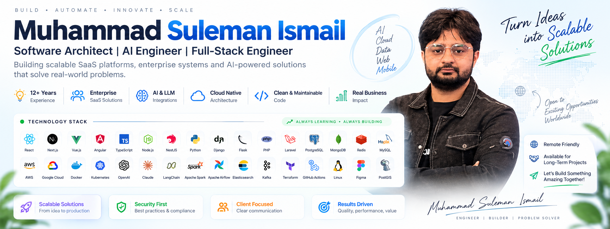

# Hi 👋, I'm Muhammad Suleman Ismail

### Software Architect · AI Engineer · Full-Stack Engineer

Architecting AI-powered SaaS platforms, enterprise systems and cloud-native solutions.

---

<!--  -->

## 👨‍💻 About Me

I'm a **Software Architect and Senior Full-Stack Engineer with 12+ years of
software delivery experience**, building production systems across telecom,
SaaS, analytics, cloud and AI.

My work spans the full engineering lifecycle — from architecture and backend
services to frontend applications, data platforms, cloud infrastructure,
observability and production optimization.

- 🏗️ Designing **scalable distributed systems, microservices and multi-tenant SaaS**
- 🤖 Building with **LLMs, RAG, Agentic AI, document intelligence and semantic search**
- ⚙️ Backend engineering with **Node.js, NestJS, Python, Flask, Django and PHP**
- 💻 Frontend development with **React, Next.js, Vue.js and Angular**
- 📊 Data engineering with **Spark, PySpark, Scala, Iceberg and Prefect**
- ☁️ Working with **AWS, GCP, Docker, Kubernetes and CI/CD**
- 🗺️ Building geospatial systems with **PostGIS, H3, GeoPandas and Mapbox**
- 📈 Production monitoring with **Prometheus, Grafana and distributed observability**

---

## 🛠️ Technology Stack

**AI & Generative AI**

`OpenAI` `Claude` `LLMs` `RAG` `Agentic AI` `Prompt Engineering`
`Function Calling` `Semantic Search` `Vector Embeddings`
`OCR` `Document Intelligence`

**Backend & APIs**

`Node.js` `NestJS` `Express` `Python` `Flask` `FastAPI` `Django`
`PHP` `Laravel` `REST` `GraphQL` `OpenAPI` `Socket.io`

**Frontend**

`React` `Next.js` `Vue.js` `Angular` `AngularJS` `TypeScript`
`JavaScript` `Redux` `RxJS` `Tailwind CSS` `Material UI`
`Vuetify`

**Data Engineering & Analytics**

`Apache Spark` `PySpark` `Spark SQL` `Scala` `Apache Iceberg`
`PyIceberg` `Prefect` `Hadoop` `Pandas` `NumPy` `PyArrow`
`Parquet` `Avro`

**Databases & Search**

`PostgreSQL` `PostGIS` `TimescaleDB` `MySQL` `MongoDB`
`Redis` `InfluxDB` `Elasticsearch` `Apache Solr`

**Cloud, DevOps & Platform**

`AWS` `GCP` `Docker` `Docker Compose` `Kubernetes`
`GitHub Actions` `TeamCity` `Jenkins` `Linux`
`Prometheus` `Grafana` `Consul` `Traefik` `MinIO`

**Architecture & Messaging**

`Microservices` `Event-Driven Architecture` `Multi-Tenant SaaS`
`CQRS` `RBAC` `RabbitMQ` `NATS`

**Geospatial**

`GeoPandas` `Shapely` `H3` `Mapbox GL` `Tegola`

**Identity, Payments & Integrations**

`Keycloak` `Auth0` `Clerk` `OAuth` `Stripe` `PayPal`
`Adyen` `Twilio` `Firebase` `OneSignal` `Apple IAP`

**Mobile**

`React Native` `Flutter` `Ionic` `Cordova`

<b>Additional technologies I've worked with</b>

 

`CodeIgniter` `Yii` `CakePHP` `WordPress` `Drupal` `Joomla`
`OpenCart` `jQuery` `KendoUI` `KnockoutJS` `Bootstrap`
`Webpack` `Vite` `Oracle` `SQLite` `PL/SQL`
`Java` `C++` `Arduino` `NodeMCU` `D3.js` `Metabase` `Mixpanel`

---

## 🚀 Selected Work

### 🧠 myTessera.ai — AI-Powered Insurance SaaS

Multi-tenant P&C insurance platform combining **Python, Flask, Vue 3,
LLMs, document extraction, structured data processing and agentic AI workflows**.

### 📡 Seamless / Smart S&D

Enterprise telecom sales and distribution platforms supporting large-scale
field-force, analytics and operational workflows.

### 📊 Riaktr Analytics & Smart Capex

Telecom analytics, geospatial and data-platform solutions involving
**Spark/PySpark, Scala, Iceberg, PostgreSQL/PostGIS, MinIO and Prefect**.

### 🏢 ERS & Unified Portal

Enterprise platforms built around modern backend services and
micro-frontend architecture.

### 💼 Rozee.pk & Mihnati.com

High-volume recruitment platforms using **PHP, Apache Solr, AngularJS,
JavaScript and REST/web services**.

### 📱 Reel Revive

AI-powered content application integrating modern mobile/backend services
and generative AI.

---

## 📊 GitHub

  
  

  

Most of my professional engineering work has been across private enterprise
repositories and production systems. This profile contains selected personal,
experimental and open-source work.

<!-- 

  

 -->

---

## 🏆 Highlights

- 💻 **12+ years** of software engineering experience
- 🏗️ Associate Software Architect / Technical Lead experience
- 🤖 Production experience with AI/LLM-powered applications
- 📡 Enterprise telecom platforms serving international operators
- ⭐ Upwork **Top Rated Plus** experience
- 🥇 Winner of **Annual Code Guru** — Centest 2013
- 🎓 MongoDB University training/certification

---

## 🤝 Let's Connect

I'm interested in challenging engineering opportunities involving:

**Software Architecture · AI Engineering · Backend Engineering ·
Full-Stack Development · Data Platforms · Cloud & DevOps**

[LinkedIn](https://linkedin.com/in/ferozpuri) •
[Email](mailto:sulman.ismail@gmail.com)

---

### Design · Build · Automate · Scale

_Building scalable AI solutions, high-performance enterprise platforms
and secure cloud applications._

